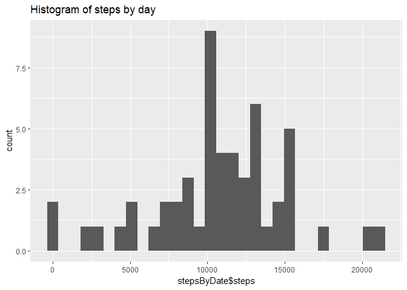
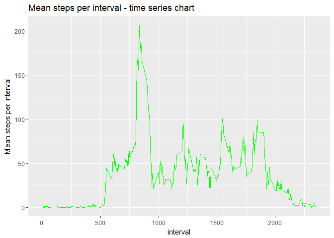
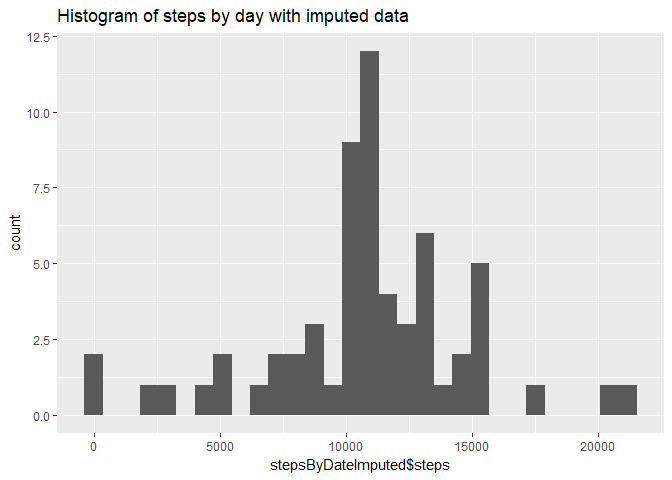
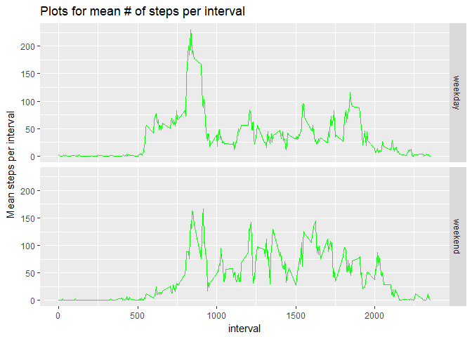

# Reproducible Research: Peer Assessment 1


## Loading and preprocessing the data

```r
library("data.table")
# Loading and preprocessing the data
# Show any code that is needed to load the data (i.e. read.csv())
# Process/transform the data (if necessary) into a format suitable for your analysis

fileUrl <- "https://d396qusza40orc.cloudfront.net/repdata%2Fdata%2Factivity.zip"

download.file(fileUrl, destfile = paste0(trimws(getwd()), '/repdata%2Fdata%2Factivity.zip'))

unzip("repdata%2Fdata%2Factivity.zip",exdir = "zip_file_data")

activity_data <- read.csv("./zip_file_data/activity.csv")
```


## What is mean total number of steps taken per day?

```r
mean(activity_data$steps, na.rm = TRUE)
```

```
[1] 37.3826
```


## Make a histogram of the total number of steps taken each day

```r
# For this part of the assignment, you can ignore the missing values in the dataset.
# Calculate the total number of steps taken per day
# If you do not understand the difference between a histogram and a barplot, research the difference between them. 
# Make a histogram of the total number of steps taken each day


# Aggreegate the data for processing
stepsByDate<-aggregate(steps ~ date, data=activity_data, sum, na.rm = TRUE)


# Generate histogram    


options(repos=c(CRAN="<something sensible near you>"))
suppressWarnings(install.packages("ggplot2"))
```

```
Installing package into 'C:/Users/Gateway/Documents/R/win-library/3.4'
(as 'lib' is unspecified)
```

```r
library("ggplot2")
qplot(stepsByDate$steps, data = stepsByDate, main = "Histogram of steps by day")
```

```
`stat_bin()` using `bins = 30`. Pick better value with `binwidth`.
```

<!-- -->


## Calculate and report the mean and median of the total number of steps taken per day

```r
mean(stepsByDate$steps)
```

```
[1] 10766.19
```

```r
median(stepsByDate$steps)
```

```
[1] 10765
```


## What is the average daily activity pattern?
- Make a time series plot (i.e. type = "l") of the 5-minute interval (x-axis) and the average number of steps taken, averaged across all days (y-axis)


```r
stepsByInterval<-aggregate(steps ~ interval, data=activity_data, mean, na.rm = TRUE)
g <- ggplot(stepsByInterval, aes( interval, steps))     # plots data from data_frame using x,y as aesthetics i.e. x and y axis
p <- g + geom_line(color = "green")  # adds shape to the plot
p <- p + labs(title = "Mean steps per interval - time series chart",  y= "Mean steps per interval")
print(p) # print plot
```

<!-- -->


## Which 5-minute interval, on average across all the days in the dataset, contains the maximum number of steps?

```r
stepsByInterval[stepsByInterval$steps == max(stepsByInterval$steps),]$interval
```

```
[1] 835
```

## Calculate and report the total number of missing values in the dataset (i.e. the total number of rows with NAs)

```r
sum(!complete.cases(activity_data))
```

```
[1] 2304
```


## Imputing missing values

- Devise a strategy for filling in all of the missing values in the dataset. The strategy does not need to be sophisticated. For example, you could use the mean/median for that day, or the mean for that 5-minute interval, etc.
- Create a new dataset that is equal to the original dataset but with the missing data filled in.
- Make a histogram of the total number of steps taken each day and 
- Calculate and report the mean and median total number of steps taken per day.


## Strategy - allocate all NAs to mean of their 5 min interval


```r
activity_data_imputed <- activity_data

for (i in 1:NROW(activity_data_imputed)) #for all rows
{
        if (is.na(activity_data_imputed[i,]$steps) == TRUE)   #if value is NA
        {
                steps <- stepsByInterval[stepsByInterval$interval == activity_data_imputed[i,]$interval,]$steps
                activity_data_imputed[i,]$steps = steps
        }
}
```

## Histogram of the total number of steps taken each day after missing values are imputed

```r
stepsByDateImputed<-aggregate(steps ~ date, data=activity_data_imputed, sum, na.rm = TRUE)
qplot(stepsByDateImputed$steps, data = stepsByDateImputed, main = "Histogram of steps by day with imputed data", bins = 30)
```

<!-- -->

## Are there differences in activity patterns between weekdays and weekends?


```r
dataWithWkdy <- activity_data_imputed

# Add column day with weeekday/weekend value
dataWithWkdy$day <- "weekday"
dataWithWkdy$day[weekdays(as.Date(dataWithWkdy$date)) %in% c("Saturday","Sunday")] <- "weekend"

dataImputedWkds <- dataWithWkdy[dataWithWkdy$day == "weekday",]
dataImputedWknds <- dataWithWkdy[dataWithWkdy$day == "weekend",]


stepsByIntervalWkds <- aggregate(steps ~ interval, data=dataImputedWkds, mean, na.rm = TRUE)
stepsByIntervalWknds <- aggregate(steps ~ interval, data=dataImputedWknds, mean, na.rm = TRUE)

stepsByIntervalWkds$dayCategory <- "weekday" 
stepsByIntervalWknds$dayCategory <- "weekend"

stepsByIntervalAll <- rbind(stepsByIntervalWkds, stepsByIntervalWknds) 


g2 <- ggplot(stepsByIntervalAll, aes( interval, steps))     # plots data from data_frame using x,y as aesthetics i.e. x and y axis
p2 <- g2 + geom_line(color = "green")  # adds shape to the plot
p2 <- p2 + labs(title = "Plots for mean # of steps per interval",  y= "Mean steps per interval") + facet_grid(dayCategory~.)
print(p2) # print plot
```

<!-- -->
